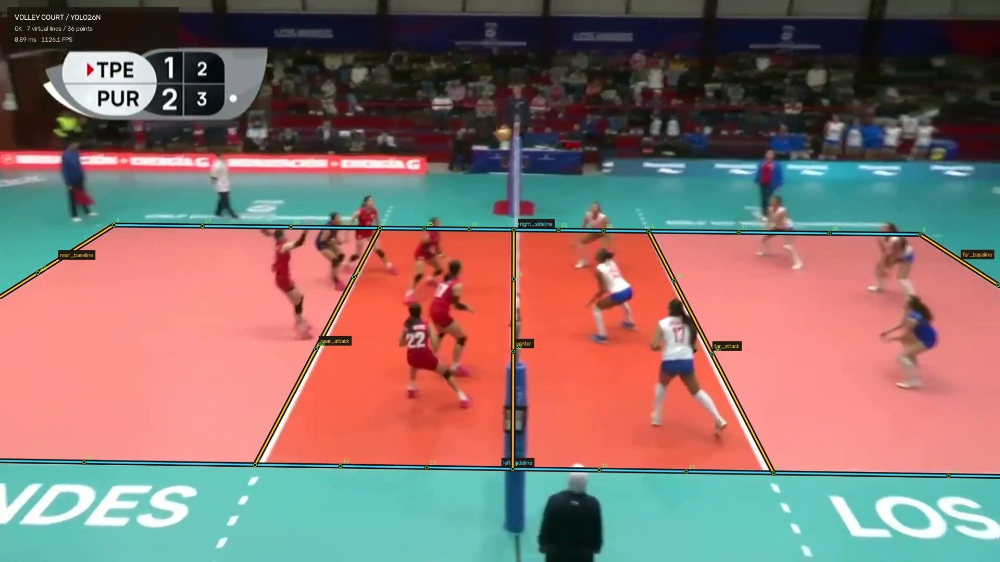

# Volley Court Lines

Fast, typed volleyball-court layout inference built on a compact YOLO26n backbone. One unified
network predicts the 36 identity-bearing court anchors and layout observability while retaining
seven-class dense zero-width line evidence as a rejection signal. An
accepted single-frame result directly contains the homography and all 36 projected keypoints.

[](https://www.python.org/)
[](https://docs.astral.sh/uv/)
[](src/volley_court/py.typed)

[](https://assets.hsulab.net/demos/volley-court-lines/v3/clip-volley-court-lines-v3.mp4)

**[Play the 14.8 s H.264 demo](https://assets.hsulab.net/demos/volley-court-lines/v3/clip-volley-court-lines-v3.mp4)**
— generated locally from every source frame of `test-videos/clip.mp4` through the public module.

The visualizer keeps evidence and accepted geometry separate. Unresolved frames do not receive a
connected court; an accepted frame shows the complete seven-line virtual court. Video mode runs
the direct layout head on every source frame and uses the tracker only for temporal stabilization.

## Install

The published wheel is the simplest internal installation path:

```bash
uv add "volley-court-lines @ https://assets.hsulab.net/packages/volley-court-lines/v0.3.0/volley_court_lines-0.3.0-py3-none-any.whl"
```

```bash
pip install "volley-court-lines @ https://assets.hsulab.net/packages/volley-court-lines/v0.3.0/volley_court_lines-0.3.0-py3-none-any.whl"
```

For development:

```bash
git clone https://github.com/henry753951/volley-court-training.git
cd volley-court-training
uv sync --group dev
```

This repository pins PyTorch to the explicit CUDA 12.8 wheel index on Windows and Linux.
Downstream uv projects should copy the PyTorch index/source block from `pyproject.toml` so the
accelerator choice remains explicit.

## Python API

The model is downloaded once, verified with SHA-256, and cached outside the repository.
OpenCV frames are BGR `numpy.uint8` arrays.

```python
import cv2

from volley_court import CourtLineModel, CourtVisualizer

frame = cv2.imread("frame.jpg")
model = CourtLineModel.from_pretrained(device="cuda:0", decoder="auto")
result = model.predict(frame, include_layout=True)

for line in result.lines:
    print(line.name, line.family, line.segment, line.score)

if result.layout and result.layout.status == "ok":
    for point in result.layout.keypoints:
        print(point.id, point.x, point.y, point.score)

rendered = CourtVisualizer().draw(frame, result)
cv2.imwrite("frame-court.jpg", rendered)
```

The result objects are immutable typed dataclasses. `to_mapping()` provides a JSON-ready bridge
for services that do not want to depend on those classes.

## CLI

```bash
uv run volley-court download

uv run volley-court predict-image frame.jpg frame-court.jpg --device cuda:0

uv run volley-court predict-video input.mp4 output.mp4 \
  --device cuda:0 --imgsz 512 --batch-size 8 --layout-every 1
```

Video output defaults to browser-safe H.264 High Profile, `yuv420p`, AAC audio, and MP4
`faststart`. It requires `ffmpeg`. The `--video-codec mp4v` compatibility path is available only as
a fallback and is not recommended for web previews.

## Published assets

| Asset | Contents | SHA-256 |
| --- | --- | --- |
| [v3 direct-layout checkpoint](https://assets.hsulab.net/models/volley-court-lines/v3/court-line-yolo26n-layout-v3.pt) | 1.66 M parameters, 6.55 MiB | `fb4abb...b71e4` |
| [v2 rollback checkpoint](https://assets.hsulab.net/models/volley-court-lines/v2/court-line-yolo26n-layout-v2.pt) | previous production model | `8fa568...a0abd` |
| [v1 rollback checkpoint](https://assets.hsulab.net/models/volley-court-lines/v1/court-line-yolo26n-v3.pt) | production rollback only | `b0392c...19e86` |
| [Synthetic dataset](https://assets.hsulab.net/datasets/volley-court-lines/v1/court36-synthetic-combined-2000-camera-mode-v2.tar.gz) | 2,000 Blender images | `5f8fa0...78569` |
| [Real dataset](https://assets.hsulab.net/datasets/volley-court-lines/v1/court36-unified.tar.gz) | 357 real images | `a40be9...12a4c` |
| [v3 demo video](https://assets.hsulab.net/demos/volley-court-lines/v3/clip-volley-court-lines-v3.mp4) | 884-frame 1080p H.264 High/yuv420p/AAC/faststart | `14796c...5a263` |

Full checksums and dataset structure are in [docs/datasets.md](docs/datasets.md).

## Performance snapshot

The release latency rows use 512 px FP16, batch 1, and include preprocessing, model, decode,
direct-layout verification, and result construction.

| GPU / path | Batch | Core FPS | Pipeline FPS | Latency |
| --- | ---: | ---: | ---: | ---: |
| RTX 5070, direct layout | 1 | 116.03 | 79.05 | 12.10 ms p50 / 15.97 ms p95 |
| H100 NVL, direct layout | 1 | 155.39 | 87.46 | 10.11 ms p50 / 26.67 ms p95 |
| RTX 5070, 1080p H.264 demo | 16 | 505.70 model/decode | 69.59 end-to-end | layout inferred every frame |

The H100 and RTX 5070 rows are independent operational measurements on different hosts, not a
claim that one GPU is universally faster. The browser-safe demo was
regenerated after the temporal identity matcher fix: 769 frames were accepted and 115 frames
abstained, with no ambiguous layout. See
[docs/benchmarks.md](docs/benchmarks.md) for methodology, raw JSON, memory use, and hardware
specifications.

## Quality snapshot

On the 37-image real test split:

- visible-keypoint PCK@1%: **50.87%**;
- visible-keypoint precision@1%: **84.30%**;
- visible-keypoint F1@1%: **63.45%**;
- accepted layouts with PCK@2% below 25%: **0**;
- layout status: 18 `ok`, 6 `ambiguous`, 13 `abstained`.

Missing and abstained keypoints count against PCK recall. The conservative verifier intentionally
prefers no connected court over a geometrically unsupported layout.

## Training design

The v3 model builds on the synthetic/real dense-context stages and the V2 direct layout:

1. **S1 synthetic:** 2,000 Blender images, 20 epochs, batch 64, BF16, frozen shared features.
2. **S2 real:** 357 real images, appearance and layout adaptation.
3. **V3 supervised sweep:** recall-aware soft-argmax layout loss with validation/test gating.
4. **Teacher consistency:** two low-rate epochs on 255 stable, unlabelled-video V2 layouts to
   prevent the real-data fine-tune from regressing temporal behavior.

This ordering teaches court geometry and camera coverage first, then adapts appearance to real
broadcasts without discarding the learned topology. Exact commands and the limitations of the
small real split are documented in [docs/training.md](docs/training.md).

## Repository layout

```text
src/volley_court/   installable inference, layout, visualization, training
configs/            topology and recorded stage parameters
datasets/           retained working datasets (not included in wheels)
blender/            synthetic-data generator and calibration tools
benchmarks/         reproducible reports and raw evidence
video-evals/        retained evaluation and demo videos
test-videos/        local regression inputs
docs/               model card, datasets, training, integration, benchmarks
```

Start with the [model card](docs/model-card.md), [training guide](docs/training.md), or
[analysis-engine integration guide](docs/integration.md).

## Distribution note

No standalone repository license has been selected yet. The repository is source-visible, but
no permission to redistribute code, weights, datasets, or demos is granted until the owner adds
explicit license terms.
