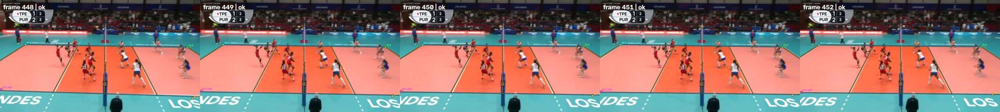

# Model card: court-line-yolo26n-layout-v3

## Summary

`court-line-yolo26n-layout-v3` is a compact single-frame volleyball-court geometry model. A
YOLO26n feature graph produces dense seven-class zero-width line evidence and a direct Pose36
anchor layout. A fixed-cost homography projects all 36 canonical keypoints. Geometry, anchor
consensus, and semantic evidence decide `ok`, `ambiguous`, or `abstained`; unsupported frames do
not receive a connected court.

V3 adds recall-aware layout training, low-rate video-teacher consistency, and a complete-layout
verifier rule. The verifier may tolerate one weak semantic identity only when all seven physical
lines match and geometric evidence is at least 0.70. Partial layouts keep the strict semantic
threshold.

## Artifact

- URL: <https://assets.hsulab.net/models/volley-court-lines/v3/court-line-yolo26n-layout-v3.pt>
- SHA-256: `fb4abb0656d313fb5b6a3ec57d5b1531ac3b5052c14575dea10d4d06f46b71e4`
- size: 6,864,067 bytes (6.55 MiB)
- parameters: 1,659,096
- recommended input: 512 px, FP16 on CUDA
- estimated compute: 5.86 GFLOPs at 512 px

V3 is the package default. V2 and V1 remain explicitly available as rollback models.

## Evaluation

The fixed real test split contains 37 images. Missing and abstained keypoints count against recall.
The raw report is
[`benchmarks/quality/direct-layout-v3-real-test-img512.json`](../benchmarks/quality/direct-layout-v3-real-test-img512.json).
V2 was rerun through the same current runtime for the comparison below.

| Metric | V2 current runtime | V3 | Change |
| --- | ---: | ---: | ---: |
| visible PCK@0.5% | 0.4501 | 0.4414 | -0.0087 |
| visible PCK@1% | 0.5037 | 0.5087 | +0.0050 |
| visible precision@1% | 0.8399 | 0.8430 | +0.0031 |
| visible F1@1% | 0.6298 | 0.6345 | +0.0048 |
| visible PCK@2% | 0.5137 | 0.5162 | +0.0025 |
| `ok` / `ambiguous` / `abstained` | 18 / 6 / 13 | 18 / 6 / 13 | unchanged |
| accepted layouts with PCK@2% below 0.25 | 0 | 0 | unchanged |
| catastrophic reprojection accepts | 0 | 0 | unchanged |

The gain is deliberately small. V3 improves the primary 1% operating point and preserves the
safety gate, but the stricter 0.5% PCK regresses by 0.87 percentage points. It is not a 90%-recall
model; the small real dataset remains the limiting factor.

## Visual evaluation

Four fixed videos were audited at three timestamps with five consecutive source frames per sheet.
Across 60 inspected frames there were no axis swaps, left/right flips, crossed polygons, collapsed
layouts, or converging ray fans. Close-ups abstain. The full 884-frame demo has 769 `ok`, zero
`ambiguous`, and 115 `abstained` tracker outputs.

[Play the browser-safe demo](https://assets.hsulab.net/demos/volley-court-lines/v3/clip-volley-court-lines-v3.mp4).
It is H.264 High/yuv420p/AAC/faststart and retains all 884 source frames.

## Training lineage

The released checkpoint starts from V2. A supervised recall-loss sweep was gated on real
validation/test data. The selected geometry was then regularized for two epochs against stable V2
layouts sampled from the unlabelled `clip` video. Teacher predictions were used only as a
consistency constraint, never as accuracy ground truth. See [training.md](training.md).

## Limitations

- The real split has only 357 images and limited negative-only imagery.
- A single visible corner or isolated line remains underdetermined and should abstain.
- Close-up recall is intentionally low.
- The optional tracker stabilizes accepted video results but cannot make a rejected single frame
  observable.
- H100 and RTX 5070 results are operational runs on different hosts.

Consumers must preserve layout status and must not coerce `ambiguous` or `abstained` results into
keypoints.

## Distribution

No standalone license has been selected. Treat the artifact as HSULab-internal until explicit
code, weight, dataset, and demo licenses are published.
