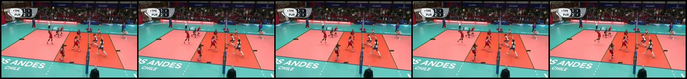

# Model card: court-line-yolo26n-layout-v2

## Summary

`court-line-yolo26n-layout-v2` is a compact single-frame volleyball-court geometry model. The
YOLO26n feature graph feeds two learned outputs in one network:

- a stride-4 dense zero-width line head with orientation, line family, seven semantic identities,
  and court ROI evidence;
- a direct Pose36 anchor head with per-point heatmaps, offsets, visibility, layout validity, and an
  eight-class spatial orientation classifier.

The direct head predicts identity-bearing anchors. A fixed-cost homography projects all 36 canonical
keypoints, while dense semantic evidence and geometry checks decide `ok`, `ambiguous`, or `abstained`.
Unsupported frames do not receive a connected court.

## Artifact

- URL: <https://assets.hsulab.net/models/volley-court-lines/v2/court-line-yolo26n-layout-v2.pt>
- SHA-256: `8fa56841200c5bc09635a2b26325a88e596a0f1198791ba5860af96ca41a0abd`
- size: 6,930,363 bytes (6.61 MiB)
- parameters: 1,663,200
- recommended input: 512 px, FP16 on CUDA
- estimated compute: 5.86 GFLOPs at 512 px (9.16 GFLOPs at 640 px)
- checkpoint format: `yolo26n-court-line-v1`, direct-layout head version 5

Production v1 remains available explicitly as `model="v1"`; v2 is the package default.

## Evaluation

The fixed real test split contains 37 images. Missing and abstained keypoints count against recall.
The raw report is
[`benchmarks/quality/direct-layout-v2-real-test-img512.json`](../benchmarks/quality/direct-layout-v2-real-test-img512.json).

| Metric | Value |
| --- | ---: |
| visible PCK@0.5% | 0.4526 |
| visible precision@0.5% | 0.7275 |
| visible PCK@1% | 0.5100 |
| visible precision@1% | 0.8196 |
| visible F1@1% | 0.6287 |
| visible PCK@2% | 0.5200 |
| layout `ok` / `ambiguous` / `abstained` | 19 / 6 / 12 |
| accepted layouts with PCK@2% below 0.25 | 0 |

Compared with the production-v1 gate, v2 raises PCK@1% from 0.4850 to 0.5100 and precision@1%
from 0.8104 to 0.8196. The gain is modest; the main release property is eliminating catastrophic
accepted layouts in the fixed evaluation and visual audits.

## Visual evaluation

Four fixed videos were evaluated at 512 px. Each has three contact sheets and every sheet contains
five consecutive source frames. Across the 60 inspected frames, accepted layouts had no 90-degree
rotation, near/far flip, crossed polygon, collapsed layout, or converging ray fan. Close-ups and
underdetermined close-ups abstain instead of inventing a court. The first five-frame full-court group
in `rMvxEtorQhw` is accepted consistently; later celebration close-ups abstain. This is intentional
safety behavior, not full-court recall.

The published browser-safe demo was regenerated after the temporal identity matcher update. It runs
the direct head on all 884 source frames, accepts 769 stable layouts, and abstains on 115
insufficient views; no frame is marked ambiguous in that demo.

## Training lineage

The dense production model was first adapted on 2,000 Blender images and 357 real images. The direct
Pose36 geometry head was then trained from that checkpoint. The released epoch adds a spatial 4x4
eight-way orientation head with balanced class weights while freezing the established geometry and
dense heads. See [training.md](training.md) for the recorded command.

## Limitations

- The real split is small and contains limited negative-only imagery.
- A single visible right angle is frequently underdetermined and should abstain.
- Close-ups have low layout recall by design.
- Single-frame prediction cannot use future frames; the optional tracker stabilizes accepted video
  results but does not turn rejected geometry into an accepted layout.
- The H100 and RTX 5070 measurements are operational runs on different hosts.

Consumers must preserve the typed layout status and must not coerce `ambiguous` or `abstained`
results into keypoints.

## Distribution

No standalone license has been selected. Treat the artifact as HSULab-internal until explicit code,
weight, dataset, and demo licenses are published.
